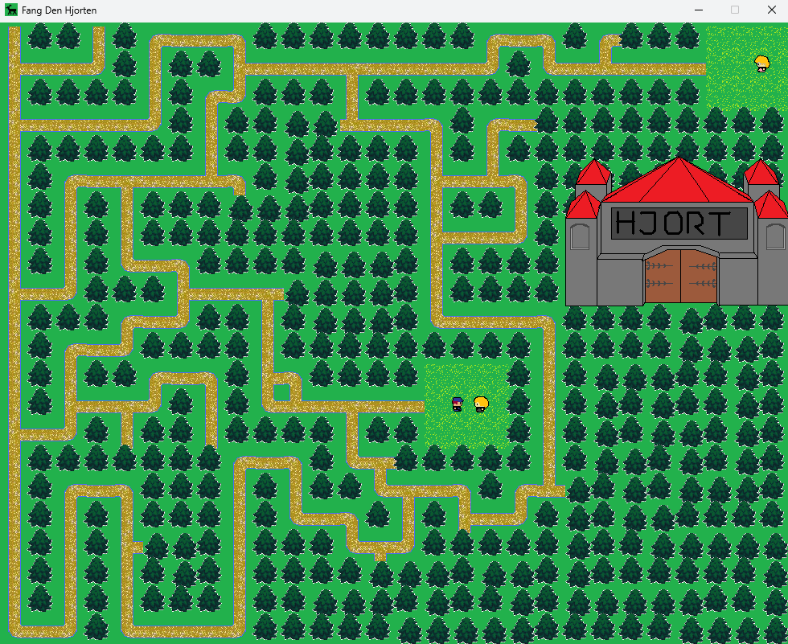
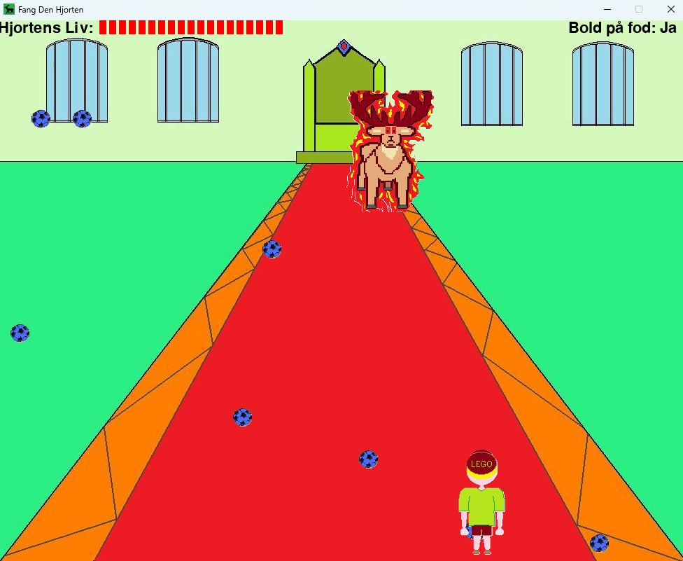

# PyGame---FangDenHjorten

A silly 2D game coded in python using the PyGame package. This repository contains:

- main.py: This is a standalone python file that defines objects, auxilliary functions, game logic and finally runs the game.
- ___.png: graphics used in the game (many of these are self-made using pen/paper, and then enhanced in paint)
- boxcat.mp3: soundtrack used in the introduction
- bump.wav: only sound used in the game, when walking into trees/obstacles 

<figure style="display: flex; gap: 2em; justify-content: center; align-items: flex-start;">
  
  
  <figcaption style="text-align: center; width: 100%; margin-top: 1em;">
    <em>Figure 1: First and second parts of the game – searching for the deer’s castle and defeating the deer by kicking balls.</em>
  </figcaption>
</figure>

